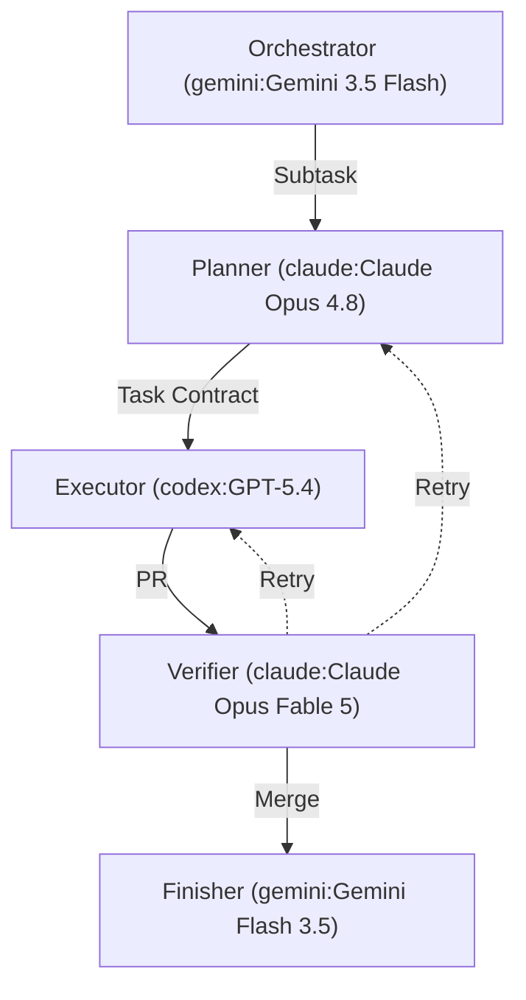

# wtcraft

> **Your Cheap Token Orchestrator (CTO).**
> For developers who can afford 3 cheap subscriptions but not 1 expensive one.

[](https://www.npmjs.com/package/wtcraft)
[](https://pypi.org/project/wtcraft/)
[](https://github.com/zywkloo/wtcraft/actions/workflows/ci.yml)
[](https://github.com/zywkloo/wtcraft/releases)
[](./LICENSE)

<p align="center">
  
</p>

## Install

```bash
pipx install wtcraft       # pip / pipx (recommended — isolated venv)
npm install -g wtcraft     # npm (global)
brew tap zywkloo/wtcraft https://github.com/zywkloo/wtcraft && brew install wtcraft
```

## Quick Start

```bash
wtcraft init                            # scaffold harness into current repo
wtcraft patch                           # append routing stubs to CLAUDE.md / AGENTS.md
wtcraft lang install --lang zh-CN       # enforce output language in CLAUDE.md
wtcraft new feat/my-task                # create worktree + task contract
wtcraft status                          # list active worktree contracts
wtcraft check <worktree-name-or-path>   # verify Scope / Off-limits
wtcraft verify <worktree-name-or-path>  # run Verification commands
```

After running `wtcraft init`, you can use these slash commands in Claude Code:
- `/planwt <task description>`: Plan task + create worktree
- `/finishwt <worktree-name>`: Run verification and finish
- `/statuswt`: List active worktree task files

## The Layered Agent Team

<!-- wtcraft:models:start -->

<!-- wtcraft:models:end -->

## Commands

| Command | Arguments | What it does |
|---|---|---|
| `wtcraft init` | `[--patch-agent-files]` | Scaffold harness files. Does not overwrite. |
| `wtcraft patch` | — | Alias for `init --patch-agent-files`. Appends routing stubs to `CLAUDE.md` / `AGENTS.md`. |
| `wtcraft unpatch` | — | Remove the routing stub from `CLAUDE.md` / `AGENTS.md`. |
| `wtcraft lang` | `install\|remove` | Add or remove language enforcement rules (e.g. `install --lang zh-CN`). |
| `wtcraft new` | `<type/name>` | Create a worktree and local `.worktree-task.md` contract. |
| `wtcraft status` | — | List active worktree tasks and their status. |
| `wtcraft check` | `<worktree-path-or-name>` | Verify the worktree's changes stay within Scope / Off-limits boundaries. |
| `wtcraft verify` | `<worktree-path-or-name>` | Run the Verification commands declared in the worktree's contract. |
| `wtcraft help` | `[command]` | Show usage. |

## Why

**$200/month for one AI agent? No.**

`wtcraft` coordinates multiple agents (Claude Pro, ChatGPT Plus, Gemini) with git worktrees, task files, and clear boundaries — so one solo developer can run parallel work without depending on one premium plan.

Raw parallelism creates common problems: unclear handoffs, context pollution, and file collisions. `wtcraft` focuses on explicit task contracts, strict boundaries, and budget-aware sequencing.

- keep agent work isolated with `git worktree`
- make agent handoffs explicit with a task contract
- keep file and task boundaries easy to verify
- stay usable from CLI + any IDE

No hosted platform is required. No custom runtime is required.

## Docs

- [Roadmap](./docs/roadmap.md)
- [Gotchas & Coding Survival Guide](./docs/gotchas/README.md)
- [Principles](./docs/principles.md)
- [Migration Notes](./docs/migration.md)
- [Changelog](./CHANGELOG.md)

## Testing

```bash
bash tests/run_all.sh
```

## License

Apache-2.0. See [LICENSE](./LICENSE).
