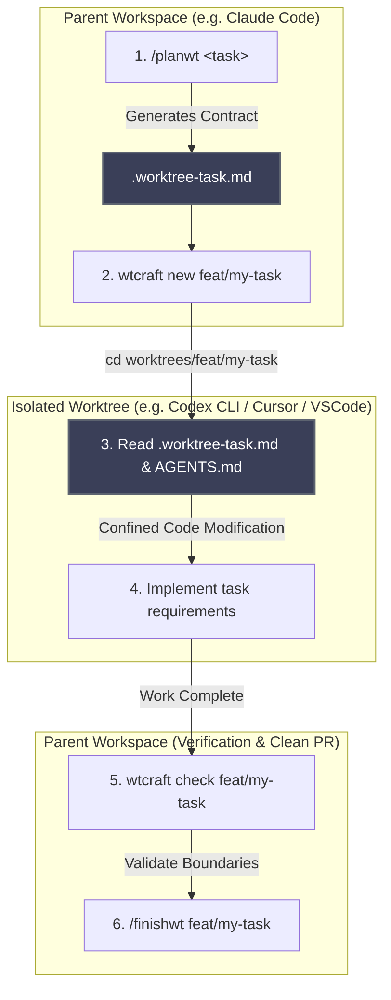

# wtcraft

[](https://www.npmjs.com/package/wtcraft)
[](https://pypi.org/project/wtcraft/)
[](https://github.com/zywkloo/wtcraft/actions/workflows/ci.yml)
[](https://github.com/zywkloo/wtcraft/releases)
[](./LICENSE)

**Budget-Aware Multi-Agent Harness**

<p align="center">
  
</p>

```bash
npm install -g wtcraft
```

`wtcraft` is a lightweight, git-native harness for solo developers orchestrating multiple coding agents on a limited budget.

**Keywords:** `Solo Dev` · `Budget-Aware` · `Agent Handoff` · `Boundaries` · `Lightweight`

The goal is simple:
- keep agent work isolated with `git worktree`
- make agent handoffs explicit with a task contract
- keep file and task boundaries easy to verify
- stay usable from CLI + any IDE

No hosted platform is required. No custom runtime is required.

## Why

Parallel agents are useful, but raw parallelism creates four common problems:
- unclear handoff between planner and executor agents
- context pollution across tasks
- file ownership collisions
- review overload from too many noisy PRs

`wtcraft` focuses on handoff, boundaries, and budget-aware sequencing, not maximum concurrency.

For the design story behind this project, read:
[wtcraft — Budget-Aware Multi-Agent Harness](https://zywkloo.github.io/blog/beyond-worktrees-budget-aware-multi-agent-coding-harness/).

## Core Model

1. Planner defines a bounded task contract.
2. Executor works only inside that contract.
3. Verifier checks scope, off-limits, and completion gates.
4. Finisher handles push/PR/cleanup.

This supports a DAG workflow:
- merge shared foundation tasks first
- run file-disjoint tasks in parallel
- serialize tasks that touch shared files

## Project Status

Early public bootstrap.

Current scope:
- open documentation for workflow and roadmap
- starter contract and command specs
- CLI MVP available (`init`, `status`, `check`)

## Requirements

| Dependency | Required | Notes |
|---|---|---|
| bash | yes | macOS / Linux native; Windows requires [Git for Windows](https://git-scm.com/download/win) (includes Git Bash) |
| git | yes | worktree support (git ≥ 2.5) |
| Claude + Codex access | yes (for full workflow) | both are expected for planner/finisher + executor roles; either CLI or App usage is acceptable |
| Package manager (npm / pipx\|pip / Homebrew) | yes (choose one) | use at least one installation path |

For the full multi-agent workflow in this repo, both Claude and Codex are expected.
You can use their CLI variants or app-based workflows, but the role split assumes both tools are available.

## Install

**npm (global):**

```bash
npm install -g wtcraft
```

**pip / pipx:**

```bash
pipx install wtcraft        # recommended — isolated venv, no conflicts
# or
pip install --user wtcraft
```

**Homebrew (tap):**

```bash
brew tap zywkloo/wtcraft https://github.com/zywkloo/wtcraft
brew install wtcraft
```

**From source (no package manager needed):**

```bash
git clone https://github.com/zywkloo/wtcraft.git
chmod +x wtcraft/scripts/wtcraft
# add wtcraft/scripts to PATH, or run directly:
wtcraft/scripts/wtcraft init
```

## Quick Start

```bash
wtcraft init                            # scaffold harness into current repo
wtcraft init --patch-agent-files        # also append routing stubs to CLAUDE.md / AGENTS.md
wtcraft new feat/my-task                # create worktree + task contract
wtcraft status                          # list active worktree contracts
wtcraft check <worktree-name-or-path>   # verify Scope / Off-limits
wtcraft verify <worktree-name-or-path>  # run Verification commands
wtcraft help [command]                  # per-command usage
```

> [!IMPORTANT]
> ### 🛡️ Safe Agent-File Patching (`--patch-agent-files`)
> By default, `wtcraft init` will not touch files outside of `.agent-harness/`.
> Passing the `--patch-agent-files` option is fully non-destructive and idempotent:
> - **If `CLAUDE.md` and `AGENTS.md` do not exist**: They are created automatically with routing instructions.
> - **If they already exist**: The stubs are appended safely at the very end of your files without overwriting any of your existing content.
> - **If already patched**: The stubs are detected automatically and ignored on subsequent runs.

What `init` scaffolds:
- `.agent-harness/planner.md`
- `.agent-harness/executor.md`
- `.agent-harness/finisher.md`
- `.claude/commands/planwt.md` → becomes the `/planwt` slash command in Claude Code
- `.claude/commands/finishwt.md` → becomes the `/finishwt` slash command in Claude Code
- `.worktree-task.template.md`

`init` is non-destructive: existing files are not overwritten.
By default `init` does not modify `CLAUDE.md` or `AGENTS.md`.
Use `--patch-agent-files` to append managed routing stubs. If `CLAUDE.md` or `AGENTS.md` do not exist, wtcraft will create them with a managed stub.

### Claude Code slash commands

After running `wtcraft init`, restart Claude Code to load the new commands:

| Command | What it does |
|---|---|
| `/planwt <task description>` | Reads `.agent-harness/planner.md` and produces a bounded `.worktree-task.md` for the task |
| `/finishwt <worktree-name>` | Reads `.agent-harness/finisher.md`, runs verification, checks boundaries, and reports results |

---

### 🔄 Multi-Agent Handoff Workflow

`wtcraft` separates the orchestration roles between the **Planner/Finisher (Claude Code)** and the **Executor (Codex CLI / Cursor / VSCode)** using a clear manual context switch. 



#### Typical Handoff Walkthrough:

1. **Plan & Boundary Setup (Claude Code)**
   ```
   /planwt add oauth login flow        # 1. plan the task → produces .worktree-task.md
   wtcraft new feat/oauth-login        # 2. create isolated worktree + seed contract
   ```
2. **Execute (Codex CLI / Cursor / VSCode)**
   Switch context into the clean worktree directory to let your executor agent work strictly within boundaries:
   ```bash
   cd worktrees/feat/oauth-login
   # Launch Codex CLI or Cursor directly in this folder.
   # The agent automatically picks up AGENTS.md and .worktree-task.md to remain sandboxed.
   ```
3. **Verify & Finish (Claude Code)**
   Switch back to your main workspace, run the boundary checks, and finish the lifecycle:
   ```
   wtcraft check feat/oauth-login      # 3. verify Scope / Off-limits boundaries
   /finishwt feat/oauth-login          # 4. run verification and finalize PR
   ```

> [!TIP]
> For discussions on how we plan to optimize or automate this handoff (and why direct execution of Codex CLI inside Claude Code CLI is traditionally complex), read the [Multi-Agent Handoff & Future Automation guide](file:///Users/stephen/Documents/To%20do%20list/wtcraft/docs/handoff-automation.md).

`new` defaults to base branch `develop`. Set `WTCRAFT_BASE_BRANCH=main` (or another branch) when needed.

## Prior Art and References

The term **harness engineering** was defined by [Martin Fowler](https://martinfowler.com/articles/harness-engineering.html) as the infrastructure and orchestration layer that wraps a coding agent — tooling, state management, error recovery, and boundary enforcement. `wtcraft` is a solo-developer implementation of that concept.

Production-scale validation:

| Source | Scale | Key insight |
|---|---|---|
| [Fowler — "Harness engineering for coding agent users"](https://martinfowler.com/articles/harness-engineering.html) | Conceptual definition | Harness = the layer between human intent and model execution |
| [OpenAI — "Harness engineering: leveraging Codex in an agent-first world"](https://openai.com/index/harness-engineering/) | 1M+ lines, 1,500+ PRs / 5 months | Context engineering + architectural constraints + entropy management |
| [Stripe — "Minions: one-shot, end-to-end coding agents"](https://stripe.dev/blog/minions-stripes-one-shot-end-to-end-coding-agents) | 1,300+ AI PRs / week | Deterministic [D] + agentic [A] step tagging; 2-round CI cap |

Fowler describes *what* harness engineering is. Stripe and OpenAI describe *how* it works at enterprise scale. `wtcraft` brings the same pattern to a solo developer with a limited budget.

## Docs

- [Roadmap](./docs/roadmap.md)
- [Principles](./docs/principles.md)
- [Migration Notes](./docs/migration.md)
- [Changelog](./CHANGELOG.md)

## Testing

```bash
chmod +x tests/smoke.sh
tests/smoke.sh
```

## License

Apache-2.0. See [LICENSE](./LICENSE).
