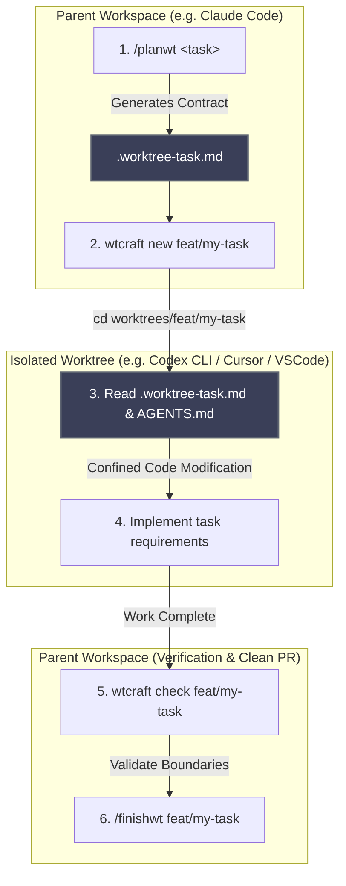

# Multi-Agent Handoff & Future Automation

One of the core design pillars of `wtcraft` is **explicit, bounded handoffs**. Rather than building a monolithic, opaque autonomous system where multiple agents run without boundaries, `wtcraft` uses a contract-first approach with isolated Git worktrees.

Currently, the handoff between agents is performed through simple, lightweight CLI and IDE context switching. This document outlines the rationale behind this manual switch, discusses the engineering challenges of direct orchestration, and presents future plans for automating and optimizing the workflow.

---

## Direct Orchestration: The Challenge

### Why is it hard to harness Codex CLI directly inside Claude Code CLI?

In an ideal setup, a single command in Claude Code might instantly delegate work to Codex, wait for it to complete, and verify the result. However, direct parent-child harnessing of complex, stateful CLI agents (like Claude Code and Codex/Copilot CLI) presents several critical technical hurdles:

1. **Context Window Inflation & Logging Chaos**: 
   Terminal agents are designed to read their own shell inputs and outputs. Running an interactive agent loop *inside* another agent loop generates highly verbose logs, overflowing the parent's context window and quickly inflating API token costs.
2. **Process Sandboxing & Shell Lifecycle**: 
   Both CLI tools are heavy, interactive node/python applications that rely on persistent, long-running shell environments. Forcing one to manage the stdin/stdout streams of another inside a subshell is highly fragile and prone to locking.
3. **Interactive Human-in-the-Loop Barriers**: 
   Coding agents frequently require human interaction (confirming command execution, resolving auth prompts, or choosing options). Direct nesting makes capturing and responding to these interactive gates virtually impossible.

---

## Recommended Manual Flow

Since nesting interactive CLIs is not robust, we recommend a clean **Context-Switch Handoff**:

### The Step-by-Step Experience:
1. **Plan (Claude Code)**: Run `/planwt <task>` to define file boundaries and scaffold `.worktree-task.md`.
2. **Isolate**: Run `wtcraft new feat/my-task` to spin up a clean worktree branch.
3. **Execute (Codex / Cursor / IDE)**: Switch focus to the worktree directory (`cd worktrees/feat/my-task`). The agent reads the local `.worktree-task.md` and routing instructions to keep its modifications strictly within scope.
4. **Verify & Finish (Claude Code)**: Switch back to the parent directory and run `wtcraft check` followed by `/finishwt` to assert boundaries, run test suites, commit, and prepare the clean PR.

---

## Future Automation Paths & Options

To make this handoff frictionless without nesting fragile CLI processes, we are exploring three non-invasive automation strategies:

### Option A: Local-First Trigger Daemons (Recommended)
A lightweight background daemon (`wtcraft watch`) that monitors the file system for worktree events:
* When a new task contract is created (status is set to `planned` or `active`), the daemon detects the change.
* It automatically triggers a local shell script or a background worker (e.g., launching your preferred executor CLI like Codex or Cursor directly in the target directory context).

### Option B: Custom Slash Commands (`/execwt`)
Creating a custom slash command inside Claude Code (e.g., `.claude/commands/execwt.md`) that executes a non-interactive script to boot the executor:
* Instead of running an interactive shell, it launches the executor in **headless/one-shot mode** (if supported by the agent, e.g., passing a single instruction file).
* It pipes only the final diff or short exit status back to the planner, preventing context pollution.

### Option C: Composable CLI Wrapper (`wtcraft run`)
A wrapper CLI command that automates the context setup:
* Run `wtcraft run <worktree> --agent <agent-name>`
* The wrapper handles the directory transit, sets the required environment variables, spins up the chosen agent, and automatically executes `wtcraft check` immediately after the sub-process terminates.
